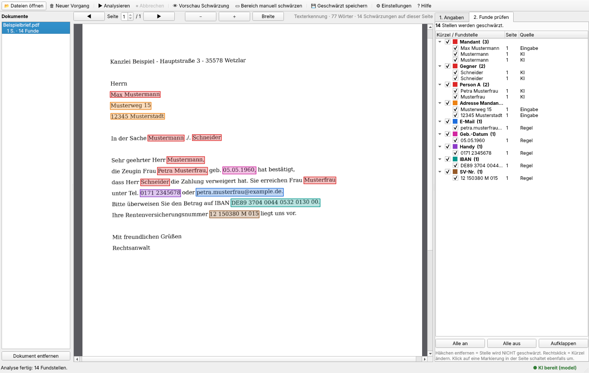
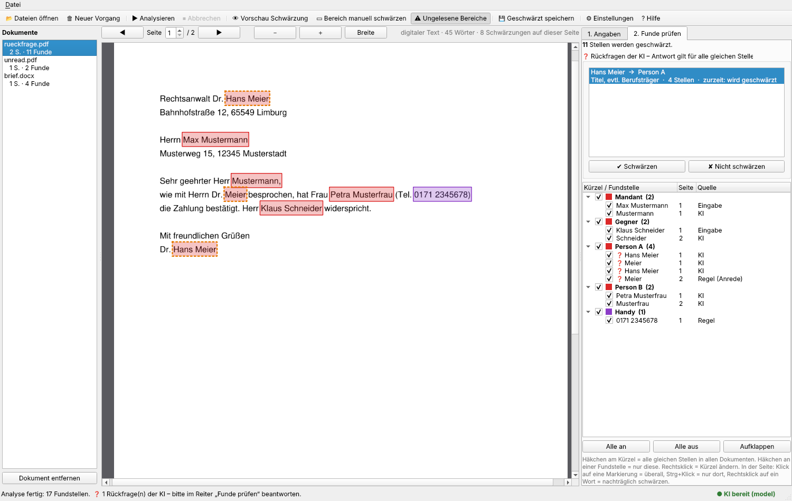
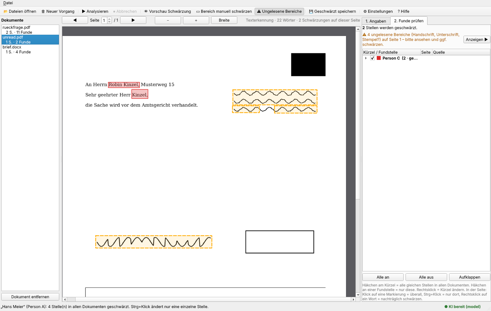
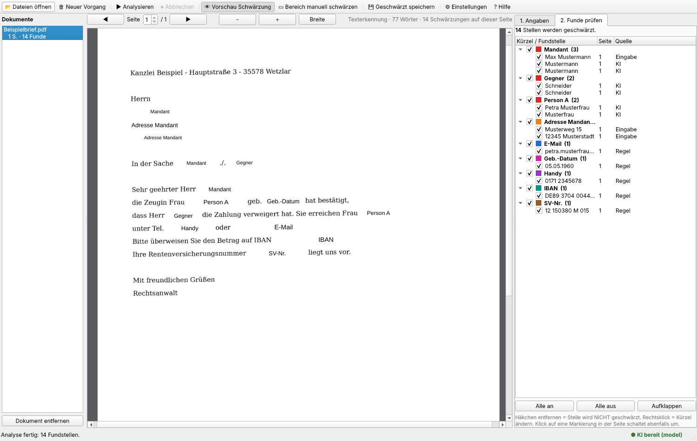
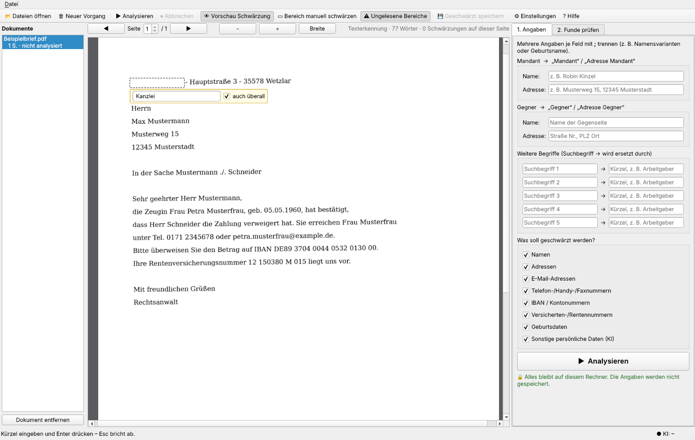

# Blackline 2 – KI-gestützte Schwärzung für die Anwaltspraxis

Blackline 2 liest PDFs und Bilder (auch eingescannte Papierakten), findet mit einer
**lokalen KI** Namen und persönliche Daten und schwärzt sie: Die Stelle wird **weiß
überdeckt** und mit einem **Kürzel in schwarzer Schrift** beschriftet
(z. B. „Mandant“, „Adresse Gegner“, „R.K.“, „Telefon“).

**Alles läuft auf Ihrem Rechner.** Es werden keine Dokumente ins Internet geschickt.
Die KI startet mit dem Programm und wird **beim Schließen automatisch beendet** –
auch wenn das Programm abstürzt oder per Task-Manager beendet wird.



*Farbig markierte Funde zum Prüfen (fiktiver Beispielbrief). Rechts gruppiert nach Kürzel.*



*Rückfrage der KI (orange gepunktet): „Hans Meier – Titel, evtl. Berufsträger“. Die Antwort gilt für alle Stellen in allen Dokumenten.*



*Gelb gestrichelt: Handschrift und Unterschrift, die keine Texterkennung lesen kann – zum Prüfen und Schwärzen per Klick.*



*Vorschau der fertigen Schwärzung: weiß überdeckt, Kürzel in schwarzer Schrift.*



*Selbst schwärzen: Bereich aufziehen, das Eingabefeld erscheint sofort, Kürzel tippen, Enter.*

---

## Funktionen

| Bereich | Was passiert |
|---|---|
| **Texterkennung (OCR)** | Eingescannte Seiten werden mit 300 dpi gelesen. Schief eingescannte Seiten werden begradigt, auf dem Kopf stehende oder quer liegende Seiten erkannt und aufgerichtet, Grauschleier/ungleichmäßige Ausleuchtung ausgeglichen. Digitale PDFs werden direkt gelesen. |
| **Ihre Angaben** | Mandant (Name, Adresse), Gegner (Name, Adresse) und 5 freie Felder „Suchbegriff → Kürzel“. Mehrere Angaben je Feld mit `;` trennen. Gefunden werden auch Varianten: nur Nachname, „R. Kinzel“, „Kinzels“, Silbentrennung („Kin-/zel“), OCR-Fehler („Kinzei“), „Str.“/„Straße“. |
| **KI** | Liest jede Seite vollständig und meldet alle Namen und persönlichen Daten natürlicher Personen. Jede weitere Person bekommt ihre Anfangsbuchstaben als festes Kürzel („Rita Klein“ → „R.K.“, „Ursula von der Leyen“ → „U.v.d.L.“), das in allen Dokumenten des Vorgangs gleich bleibt. Haben zwei Personen dieselben Anfangsbuchstaben, werden sie unterschieden („R.Ki.“ / „R.Kl.“, notfalls „H.M.“ / „H.M. (2)“). Mandant und Gegner heißen weiterhin „Mandant“ und „Gegner“. Was die KI auf einer Seite findet, wird automatisch auch auf allen anderen Seiten geschwärzt. Erfundene Funde („Halluzinationen“) werden verworfen, weil nur geschwärzt wird, was wirklich im Text steht. |
| **Sicherheitsnetz für Namen** | Unabhängig von der KI gilt jedes Wort nach Anreden und Rollen („Herr“, „Frau“, „Dr.“, „Zeugin“, „Nachbarin“, „Kläger“ …) als Name – auch im Anschriftenfeld („Herrn“ / nächste Zeile). So bleibt kein Name stehen, nur weil die KI ihn übersehen hat. |
| **Feste Regeln** | E-Mail, Telefon/Handy/Fax, IBAN (mit Prüfziffer) und Kontonummern, Sozialversicherungs-/Renten-/Krankenversichertennummern, Versicherungsscheinnummern, Geburtsdaten („geb.“, „geb. am“, „geboren am“, „Geburtsdatum:“, „\*“), Geburtsort und Geburtsname. |
| **Rückfragen der KI** | Ist sich die KI nicht sicher (z. B. Rechtsanwalt der Gegenseite, Firmenname mit Personenname, Ort ohne klaren Wohnortbezug), stellt sie eine Rückfrage mit kurzer Begründung. Ihre Antwort „Schwärzen“ / „Nicht schwärzen“ gilt sofort für **alle gleichen Stellen in allen geladenen Dokumenten**. |
| **Entscheidungen gelten überall** | Klick auf eine Markierung schaltet alle gleichen Stellen in allen Dokumenten um (gleiche Person bzw. gleicher Text). Strg+Klick ändert nur die eine Stelle. |
| **Nachträglich schwärzen** | Rechtsklick auf ein beliebiges Wort → „überall schwärzen als …“: Der Begriff wird sofort in allen Dokumenten gesucht und geschwärzt – ohne die KI erneut laufen zu lassen. Auch beim manuellen Aufziehen eines Bereichs wird der enthaltene Text auf Wunsch überall gesucht. |
| **Ungelesene Bereiche** | Handschrift, Unterschriften und Stempel kann keine Texterkennung lesen – und damit auch die KI nicht. Blackline 2 erkennt solche Tintenbereiche und zeigt sie gelb gestrichelt an („bitte ansehen“). Ein Klick schwärzt den Bereich. |
| **Prüfen** | Alle Funde farbig markiert, Liste nach Kürzel gruppiert (mit Gesamtzahl über alle Dokumente), Kürzel umbenennbar, Vorschau des Endergebnisses, Restzeitanzeige bei langen Analysen. |
| **Vorgang sichern** | Menü „Datei → Vorgang sichern“ speichert Funde, Eingaben und Personen in eine `.blackline2`-Datei (enthält Mandantendaten – vertraulich behandeln). Beim Laden werden die Dokumente neu eingelesen und die Entscheidungen wiederhergestellt. |
| **Speichern** | Standard „Bild-PDF“: Jede Seite wird als Bild neu aufgebaut, die Bildpunkte unter den Schwärzungen werden überschrieben – es bleibt nichts Verstecktes übrig. Alternativ „Text-PDF“ (durchsuchbar) mit echter PDF-Redaction und automatischer Nachprüfung. Namen im **Dateinamen** werden ebenfalls durch Kürzel ersetzt („Kinzel_Klage.pdf“ → „Mandant_Klage_geschwärzt.pdf“). Das Original wird nie verändert. |

Unterstützte Dateien: PDF, PNG, JPG, TIFF (auch mehrseitig), BMP, GIF, WEBP sowie
**Word (.docx, .doc), .odt und .rtf**. Word-Dateien werden über ein installiertes
Microsoft Word, sonst über LibreOffice in PDF umgewandelt; ist beides nicht vorhanden,
wird der Text in vereinfachter Darstellung gesetzt. Das Ergebnis ist immer ein PDF,
die Word-Datei bleibt unverändert.

---

## Fertige Programme für Mac und Windows

Unter **[Releases](https://github.com/robinpkinzel-tech/Blackline2/releases)** liegen fertige Programme,
die ohne Python-Installation laufen. Sie werden automatisch von GitHub gebaut
(`.github/workflows/release.yml`).

### Mac (Apple Silicon, macOS 12 oder neuer)

1. `Blackline2-macOS.dmg` herunterladen und öffnen.
2. „Blackline 2“ in den Ordner **Programme** ziehen.
3. **Erster Start:** Im Finder → Programme → Rechtsklick auf „Blackline 2“ → **Öffnen** → im Hinweisfenster
   noch einmal **Öffnen**. macOS warnt, weil die App nicht bei Apple notarisiert ist (das kostet ein
   Entwicklerkonto). Erscheint kein „Öffnen“-Knopf (macOS 15): **Systemeinstellungen → Datenschutz &
   Sicherheit** → ganz unten **„Dennoch öffnen“**. Das ist nur beim ersten Mal nötig.
4. Blackline 2 fragt, ob die KI eingerichtet werden soll → **Ja** → Modell wählen → **Einrichtung
   starten** (Download 2,5–5 GB, einmalig). Die Grafikeinheit des Mac wird automatisch genutzt.

Die KI und die Texterkennungsdaten landen in `~/Library/Application Support/Blackline2/`.
Später lässt sich alles über **Datei → KI einrichten / aktualisieren** ändern.

**Neue Version installieren:** einfach die neue `Blackline2-macOS.dmg` laden und die App in „Programme“
ersetzen. Das schon geladene KI-Modell bleibt im Benutzerordner und wird von der neuen Version
weiterverwendet – es wird nichts doppelt heruntergeladen. Die Einrichtung erkennt vorhandene Modelle
(„✓ vorhanden“), auch solche aus LM Studio, dem llama.cpp-/Hugging-Face-Zwischenspeicher oder dem
Download-Ordner, und setzt angefangene Downloads fort („⏸ angefangen“).

### Windows (fertiges Programm statt Python)

1. `Blackline2-Windows.zip` herunterladen, z. B. nach `C:\Blackline2` entpacken.
2. `Blackline 2.exe` starten. SmartScreen: „Weitere Informationen“ → „Trotzdem ausführen“.
3. KI-Einrichtung wie oben; Ablage in `%APPDATA%\Blackline2\`.

Neue Version veröffentlichen (für Entwickler): auf GitHub unter **Releases → Draft a new release** einen
Tag `v0.2.0` o. ä. anlegen und veröffentlichen – der Workflow baut die Dateien und hängt sie an.
Ohne Tag liefert **Actions → Release → Run workflow** die Dateien als Artefakte.

---

## Einrichtung unter Windows aus dem Quellcode (einmalig)

Voraussetzungen: Windows 10/11, mind. 16 GB RAM empfohlen, ca. 8 GB freier Speicher.

1. **Python installieren** (falls noch nicht vorhanden): <https://www.python.org/downloads/> →
   „Download Python 3.12“ → Installer starten → unten **„Add python.exe to PATH“ anhaken** →
   „Install Now“.
2. **Blackline 2 herunterladen**: Auf GitHub → grüner Knopf **„Code“** → **„Download ZIP“** →
   ZIP z. B. nach `C:\Blackline2` entpacken.
   (Oder mit Git: `git clone https://github.com/robinpkinzel-tech/Blackline2.git C:\Blackline2`)
3. **Einrichten**: Im Ordner `C:\Blackline2` doppelt auf **`einrichten_windows.bat`** klicken.
   Das Skript installiert alles Nötige und lädt die KI (ca. 5 GB) sowie die deutschen
   OCR-Sprachdaten herunter. Am Ende folgt ein kurzer Selbsttest der KI.
4. **Starten**: Doppelklick auf **`Blackline2_starten.bat`**.

### Varianten der Einrichtung

Im Terminal (Eingabeaufforderung) im Programmordner:

```bat
cd C:\Blackline2
einrichten_windows.bat --modell schnell      :: kleineres Modell (2,5 GB) für ältere Rechner
einrichten_windows.bat --gpu vulkan          :: Grafikkarte nutzen (AMD/Intel/NVIDIA)
einrichten_windows.bat --gpu cuda            :: NVIDIA-Grafikkarte mit CUDA
einrichten_windows.bat --modell gruendlich   :: größtes Modell (7 GB), sehr gutes Deutsch
```

| Modell | Größe | Empfehlung |
|---|---|---|
| `schnell` – Qwen3 4B | ca. 2,5 GB | ältere Rechner ohne Grafikkarte, 8–16 GB RAM |
| `ausgewogen` – Qwen3 8B (Standard) | ca. 5 GB | 16 GB RAM |
| `gruendlich` – Gemma 3 12B | ca. 7 GB | Grafikkarte oder 32 GB RAM |

Richtwert ohne Grafikkarte: ca. 20–60 Sekunden pro Seite für die KI-Prüfung
(Texterkennung ca. 1–2 Sekunden pro Seite). Mit Grafikkarte deutlich schneller.

Eigenes Modell: Jede `.gguf`-Datei in `ki\modelle\` kann verwendet werden
(Einstellungen → KI → KI-Modell).

---

## Bedienung

1. **Dokumente laden** – „Dateien öffnen“ oder Dateien/Ordner ins Fenster ziehen.
2. **Angaben eintragen** (Reiter „1. Angaben“):
   * Mandant: Name → wird zu „Mandant“, Adresse → „Adresse Mandant“
   * Gegner: Name → „Gegner“, Adresse → „Adresse Gegner“. Häkchen **„Gegner ist eine juristische
     Person / Behörde“**: Name und Anschrift des Gegners (Firma, Versicherung, Jobcenter …) bleiben
     lesbar; Personen, die für ihn handeln (Sachbearbeiter, Geschäftsführer), werden trotzdem geschwärzt
   * Bis zu 5 freie Begriffe, z. B. `Volkswagen` → `Arbeitgeber`
3. **Analysieren** – Regeln und KI laufen über alle Seiten aller Dokumente.
4. **Funde prüfen** (Reiter „2. Funde prüfen“):
   * Oben: **Rückfragen der KI** anklicken und mit „Schwärzen“ / „Nicht schwärzen“ beantworten –
     gilt für alle gleichen Stellen in allen Dokumenten
   * Gelbe Hinweiszeile: **ungelesene Bereiche** (Handschrift, Stempel) mit „Anzeigen“ ansehen;
     Klick auf den gelben Rahmen schwärzt ihn
   * Markierung anklicken = überall nicht schwärzen (gestrichelt) / wieder schwärzen;
     **Strg+Klick** = nur diese Stelle
   * **Rechtsklick auf ein Wort** = nachträglich überall schwärzen, Kürzel wählen
   * Rechtsklick in der Liste = Kürzel ändern (z. B. „R.K.“ → „Zeuge 1“)
   * **Selbst schwärzen:** In der „Vorschau Schwärzung“ (oder mit Shift+Ziehen in jeder Ansicht) einen
     Bereich mit der Maus aufziehen – er wird sofort weiß, direkt darunter erscheint das Eingabefeld für
     das Kürzel. Tippen, **Enter** – fertig. Häkchen „auch überall“ schwärzt den enthaltenen Text
     zusätzlich in allen Dokumenten. Esc bricht ab.
   * „Vorschau Schwärzung“ = so sieht das Ergebnis aus
5. **Geschwärzt speichern** – Zielordner wählen; Dateien erhalten den Zusatz `_geschwärzt`.

Farben: rot = Namen, orange = Adressen, blau = E-Mail, lila = Telefon,
türkis = IBAN, braun = Versicherungsnr., pink = Geburtsdaten, grün = eigene Begriffe.

---

## Datenschutz und Sicherheit

* **Keine Cloud**: Die KI (llama.cpp) läuft lokal und ist nur über `127.0.0.1` erreichbar,
  mit einem bei jedem Start neu erzeugten Zugangsschlüssel.
* **KI nur solange das Programm offen ist**: Beim Schließen wird die KI beendet.
  Unter Windows ist sie zusätzlich an ein Job-Objekt gekoppelt – endet Blackline 2
  auf irgendeine Weise, beendet Windows die KI automatisch mit. Verwaiste Prozesse
  eines früheren Absturzes werden beim nächsten Start aufgeräumt.
* **Keine Speicherung von Mandantendaten**: Die Eingabefelder werden nicht gespeichert.
  Gespeichert werden nur technische Einstellungen (`%APPDATA%\Blackline2\einstellungen.json`).
* **Sichere Schwärzung**: Im Bild-Modus enthält das Ergebnis nur noch Bildpunkte,
  unter den Schwärzungen weiß überschrieben. Metadaten werden entfernt.
  PDF-Kommentare, Stempel und Formularfelder werden vor der Analyse in die Seite
  eingebrannt (Namen darin werden mitgeschwärzt), versteckte Notizen fallen weg.
* **Plausibilitätsprüfung der KI**: Die KI darf eine Person nur dann „Mandant“ oder „Gegner“
  nennen, wenn der Name zu Ihren Angaben passt. Gewöhnliche Daten (Zahlungs-, Termindaten)
  werden nicht als Geburtsdatum geschwärzt, Rollenwörter („Zeugin“) nie als Namensteil.
* **Kontrolle bleibt beim Menschen**: Die KI ist ein Hilfsmittel. Bitte das Ergebnis
  vor der Weitergabe in der Vorschau prüfen.

---

## Fehlerbehebung

| Problem | Lösung |
|---|---|
| Statusleiste: „Nicht eingerichtet“ | `einrichten_windows.bat` erneut ausführen. |
| „deu.traineddata nicht gefunden“ | Terminal: `cd C:\Blackline2` → `.venv\Scripts\python -m blackline2.setup_ki --nur-ocr` |
| KI startet nicht | In der Statusleiste auf den KI-Status klicken → Protokoll ansehen. Ggf. `--modell schnell` probieren oder unter Einstellungen → KI die GPU-Schichten auf 0 setzen. |
| KI sehr langsam | Kleineres Modell (`--modell schnell`) oder Grafikkarte nutzen (`--gpu vulkan`). |
| Download bricht ab | Einfach erneut starten – angefangene Downloads werden fortgesetzt. |
| Selbsttest der KI | `cd C:\Blackline2` → `.venv\Scripts\python -m blackline2.setup_ki --test` |

---

## Für Entwickler

```bash
python -m venv .venv && . .venv/bin/activate     # Windows: .venv\Scripts\activate
pip install -r requirements.txt pytest
python -m blackline2.setup_ki --nur-ocr
python -m pytest                                  # Tests (KI wird durch eine Attrappe ersetzt)
BLACKLINE_REAL_KI=1 python -m pytest tests/test_real_ki.py -s   # mit echter KI
python -m blackline2                              # Programm starten
```

Aufbau:

```
blackline2/
  loader.py          PDF/Bilder/Word laden, Seitendrehung normalisieren, OCR je Seite (parallel)
  ocr.py             Vorverarbeitung, Tesseract via PyMuPDF, Nachlese, ungelesene Bereiche
  matching.py        tolerante Suche (OCR-Fehler, Silbentrennung, Genitiv, Straße/Str.)
  detect_patterns.py feste Regeln (E-Mail, Telefon, IBAN, Versicherungsnr., Geburtsdatum)
  detect_inputs.py   Mandant/Gegner/freie Begriffe
  detect_names.py    Sicherheitsnetz: Namen nach Anreden und Rollen
  session.py         Vorgang sichern/laden (.blackline2)
  setup_ki.py        Download von llama.cpp, Modell und OCR-Daten (Konsole und Oberfläche)
  gui/setup_dialog.py Einrichtung aus dem Programm heraus
packaging/           PyInstaller-Spec und Symbol für die fertigen Programme
  labels.py          Kürzel und Personenverwaltung (Anfangsbuchstaben „R.K.“)
  ai/server.py       Start/Stopp von llama-server (Job-Objekt, PDEATHSIG, Wächter)
  ai/client.py       OpenAI-kompatibler Client (nur localhost)
  ai/detector.py     Prompt, JSON-Schema, Auswertung der KI-Antworten
  analysis.py        Gesamtablauf, Vorrangregeln, Übertragung auf alle Seiten
  export.py          Schwärzen (weiß + Kürzel), Bild- oder Text-PDF, Nachprüfung
  setup_ki.py        Download von llama.cpp, Modell und OCR-Daten, Selbsttest
  gui/               Oberfläche (PySide6)
```

Die GitHub-Actions-Prüfung (`.github/workflows/tests.yml`) testet unter Windows und Linux
auch die echte KI: Download von llama.cpp und Modell, Selbsttest und ein vollständiger
Durchlauf Scan → OCR → KI → Schwärzung → erneute OCR-Prüfung des Ergebnisses.

## Nächste Schritte

* Tabellen mit Spaltenüberschriften („Geburtsdatum“ über einer Spalte) regelbasiert erkennen
* Durchlauf mit dem Standardmodell „ausgewogen“ in der CI (manuell über „Run workflow“ wählbar)
